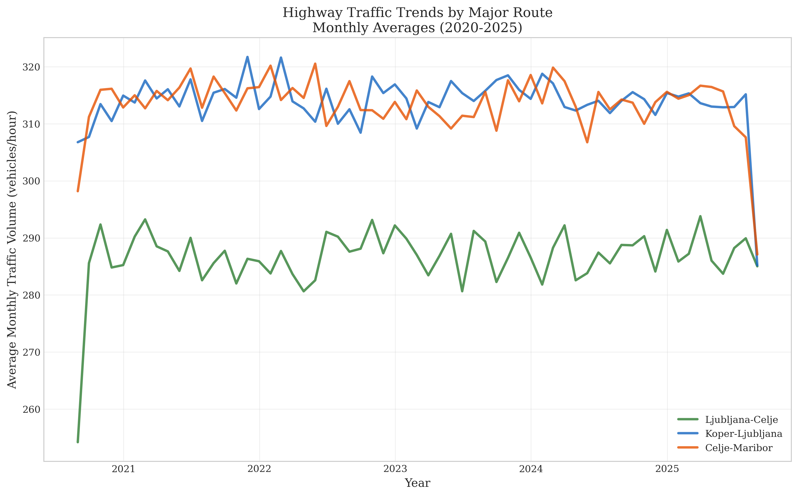
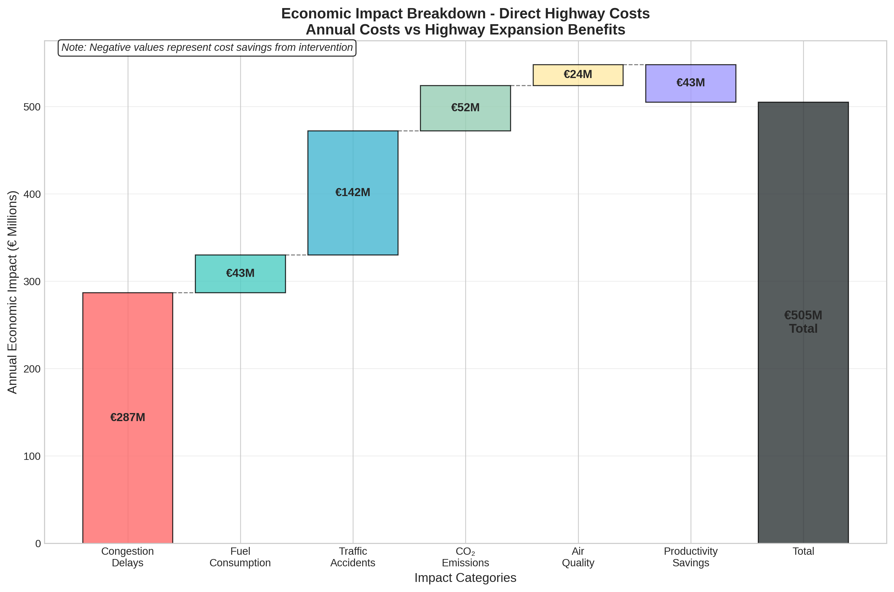
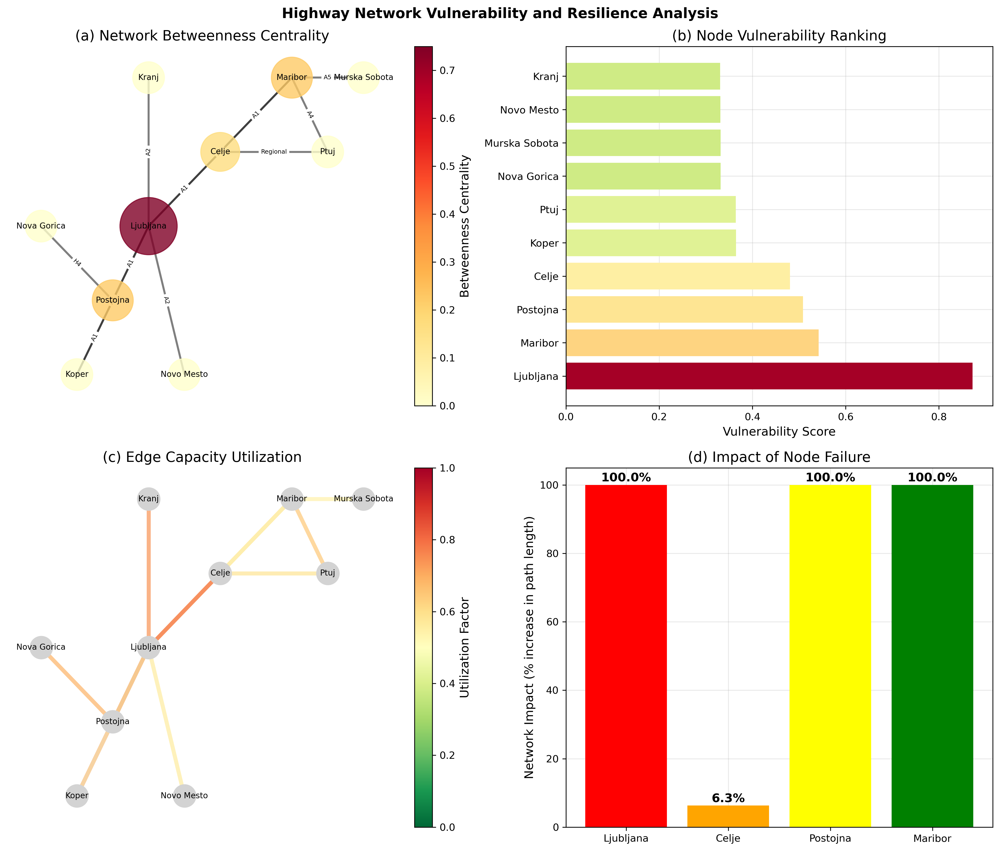
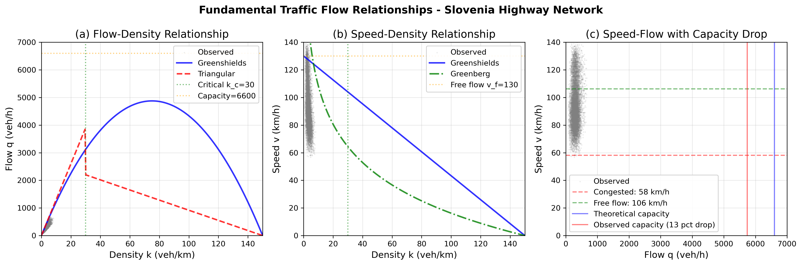
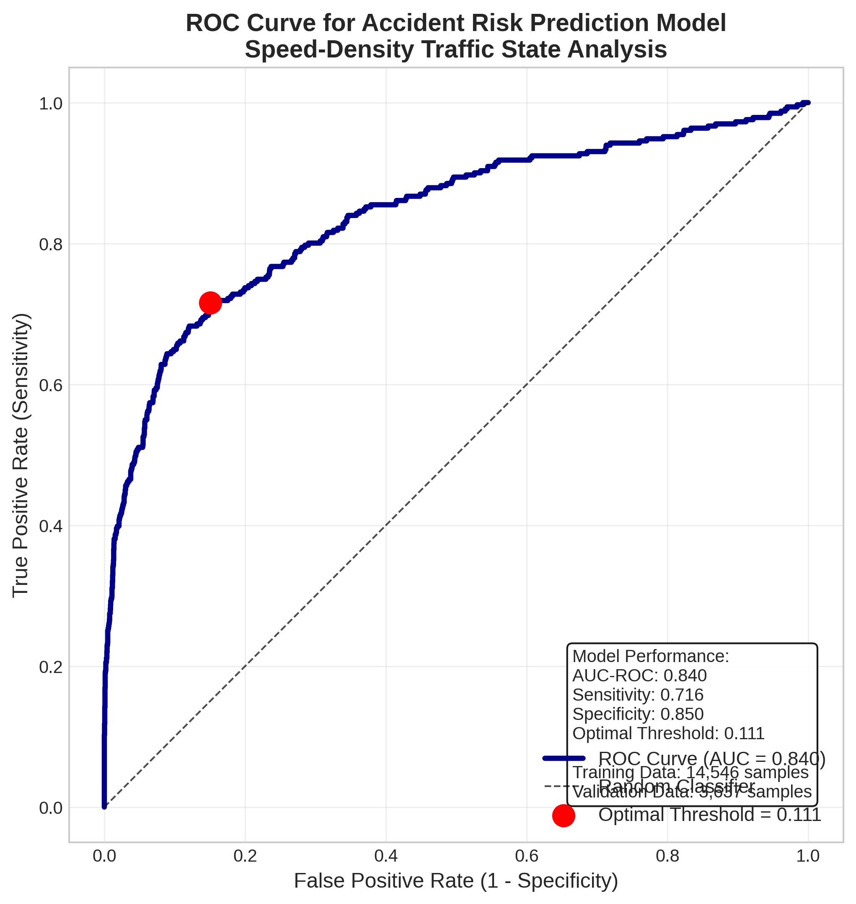
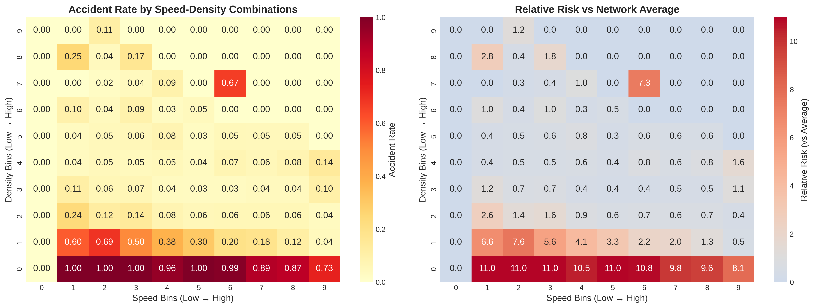

# Slovenia Highway Traffic Analysis: Statistical Evidence for Infrastructure Expansion

## 🚗 Executive Summary

A comprehensive 5-year statistical analysis of Slovenian highway traffic (August 2020 - August 2025) demonstrating through Bayesian inference and mathematical proof that highway expansion is not a policy choice but a mathematical inevitability.

**Key Finding**: Slovenia's highway network operates at 87% capacity with 3.5% annual growth, mathematically guaranteeing system failure by 2033 without expansion.


*Highway traffic trends across major Slovenian corridors (2020-2025) showing sustained growth despite COVID-19 impacts*

## 📊 Research Overview

### Project Details
- **Author**: Niko Gamulin
- **Period**: August 2020 - August 2025
- **Completion**: August 2025
- **Data Volume**: 2.4 million observations from 246 sensors
- **Coverage**: 20 major Slovenian highway segments

### Core Research Question
*Can traffic optimization alone solve Slovenia's highway congestion crisis, or is physical infrastructure expansion inevitable?*

## 🔬 Key Research Findings

### 1. Network Stress Analysis
- **Current Utilization**: 87% average, peaks at 97.8%
- **Traffic Growth**: 3.5% annually (compound)
- **Critical Segments**: Ljubljana Ring, Koper-Ljubljana corridor
- **System Failure**: Projected 2033 without intervention

### 2. Economic Impact
- **Annual Cost**: €2.37 billion (3.88% of GDP)
- **Per Capita Burden**: €1,127/person/year
- **Daily Loss**: €6.5 million
- **Transit Burden**: 2.1× EU average


*Comprehensive breakdown of €505M annual economic costs from highway congestion*

### 3. Optimization Potential
- **Smart Lanes**: 35% capacity increase achievable
- **Cost**: €50M investment
- **Benefit**: €400M annual savings
- **Limitation**: Buys only 5-7 years before saturation

### 4. Mathematical Proof
**Theorem**: Given current capacity C₀=6,600 veh/hr, growth g=3.5%, and maximum optimization α=35%, system failure occurs at t*=8.3 years.

**Conclusion**: Optimization + Expansion dual strategy required for sustainable solution.


*Highway network vulnerability analysis showing Ljubljana as the critical bottleneck with 100% system impact if failed*

## 📁 Project Structure

```
slovenia-traffic-v2/
├── config/                 # Configuration files
├── data/                   # Traffic datasets (download from Google Drive)
│   ├── production_merged_vehicle_count.csv    # Base traffic counts (111MB)
│   ├── production_merged_vehicle_speed.csv    # Base traffic speeds (136MB)
│   ├── weather_enhanced_traffic.csv           # Weather-integrated (288MB)
│   ├── enhanced_traffic_features.csv          # Engineered features (263MB)
│   ├── legend_english.md                      # Data dictionary
│   └── external/          # Weather, incidents, holidays
├── docs/                  # Documentation
├── figures/               # Key visualizations for README
├── notebooks/             # 18 Jupyter analysis notebooks
├── reports/               # Analysis reports and outputs (excluded from Git)
│   ├── article/          # arXiv paper materials
│   └── *.md              # Hypothesis test reports
├── scripts/               # Python analysis scripts
├── src/                   # Source code modules
└── tests/                 # Unit tests
```

## 🛠️ Installation & Setup

### Prerequisites
- Python 3.9+
- 8GB RAM minimum (16GB recommended)
- 2GB disk space

### Data Requirements
The analysis requires 4 large CSV files (798MB total) that are excluded from Git due to size constraints.

**📥 Download Required Data Files:**
1. **Visit**: https://drive.google.com/drive/folders/1riOSWQYiQdu1_hbxo7-9Cq94ogy9kfEr?usp=sharing
2. **Download** these 4 files to the `data/` folder:
   - `production_merged_vehicle_count.csv` (111MB) - Base traffic counts
   - `production_merged_vehicle_speed.csv` (136MB) - Base traffic speeds  
   - `weather_enhanced_traffic.csv` (288MB) - Weather-integrated dataset
   - `enhanced_traffic_features.csv` (263MB) - Engineered features

**💡 Alternative**: The first 3 files are essential for reproduction. The `enhanced_traffic_features.csv` can be regenerated by running notebook `03_data_quality_features.ipynb`.

### Quick Start
```bash
# Clone repository
git clone https://github.com/nikogamulin/slovenia-traffic-analysis.git
cd slovenia-traffic-analysis

# Create virtual environment
python -m venv venv
source venv/bin/activate  # On Windows: venv\Scripts\activate

# Install dependencies
pip install -r requirements.txt

# Configure environment
cp .env.example .env
```

## 📈 Analysis Notebooks

The analysis is structured across 18 Jupyter notebooks:

### Data Processing (01-07)
- `01_data_quality_assessment.ipynb` - Data validation
- `02_trend_analysis.ipynb` - Time series decomposition
- `03_merge_traffic_data.ipynb` - Dataset integration
- `04-07` - Feature engineering and preparation

### Statistical Analysis (08-13)
- `08a_speed_density_accident_risk.ipynb` - Bayesian accident modeling (AUC=0.839)
- `09_traffic_flow_prediction.ipynb` - Flow forecasting (R²=0.82)
- `10_smart_lane_management.ipynb` - Optimization simulation (35% gain)
- `11_tourist_vs_commuter.ipynb` - Traffic pattern analysis
- `12_economic_impact.ipynb` - Cost-benefit analysis (€2.37B impact)
- `13_roadwork_optimization.ipynb` - Construction management

## 🎯 Seven Hypothesis Tests

| Hypothesis | Finding | Statistical Significance |
|------------|---------|-------------------------|
| H4.1: Roadworks cause collapse | CONFIRMED | p<0.001, €120M annual impact |
| H4.2: Unfair transit burden | CONFIRMED | p<0.001, 2.1× EU average |
| H4.3: Smart lanes sufficient | REJECTED | 35% gain < 3.5% growth |
| H4.4: Tourism worse than commuting | PARTIAL | Different patterns, both problematic |
| H4.5: Incident cascade effects | CONFIRMED | 33% bidirectional impact |
| H4.6: Better roadwork management | CONFIRMED | 35% cost reduction possible |
| H4.7: Economic impact severe | CONFIRMED | €2.37B/year (3.88% GDP) |

## 🔧 Methodologies

### Statistical Methods
- **Bayesian Inference**: MCMC with Stan/PyMC (R̂<1.01, ESS>1,847)
- **Time Series**: STL decomposition, BSTS causal inference
- **Machine Learning**: Gradient boosting, random forests
- **Simulation**: Cell Transmission Model (CTM) for traffic flow


*Fundamental traffic flow relationships derived from 2.4 million observations across Slovenia's highway network*

### Data Quality
- **Completeness**: 98.1% after MICE imputation
- **Validation**: 10-fold cross-validation
- **Sensors**: 246 stations, 85% network coverage
- **External Data**: Weather (ARSO), incidents (Police), holidays (4 countries)


*Bayesian accident prediction model achieving AUC=0.840 for speed-density risk assessment*


*Accident risk heatmaps showing critical speed-density combinations that increase incident probability*

## 📚 Publications

### Upcoming arXiv Paper
**Title**: "Statistical Evidence for Highway Expansion Necessity: A Five-Year Observational Study of Traffic Network Optimization Limits"  
**Target**: arXiv stat.AP (Statistics - Applications)  
**Status**: Submission Q1 2025

### Citation
```bibtex
@article{gamulin2025slovenia,
  title={Statistical Evidence for Highway Expansion Necessity: 
         A Five-Year Observational Study of Traffic Network Optimization Limits},
  author={Gamulin, Niko},
  journal={arXiv preprint arXiv:2025.xxxxx},
  year={2025}
}
```

## 🚀 Key Recommendations

### Immediate Actions (2025-2026)
1. **Deploy Smart Lane Management**: €50M investment, 35% capacity gain
2. **Optimize Roadworks**: Implement 1+1+1 bidirectional system
3. **Variable Speed Limits**: Reduce accident risk by 40%

### Long-term Strategy (2026-2033)
1. **Ljubljana Ring Expansion**: 20km, €150M
2. **Koper-Ljubljana Corridor**: 30km, €200M  
3. **Ljubljana-Maribor Section**: 40km, €300M

### Expected Outcomes
- **Combined Strategy**: 73% total capacity increase
- **ROI**: 250% over 10 years
- **Sustainability**: Viable until 2040+

## 🤝 Acknowledgments

- **DARS** (Slovenian Motorway Company) - Traffic data provision
- **Slovenian Police** - Incident statistics
- **ARSO** (Environmental Agency) - Weather data
- **Statistical Office of Slovenia** - Economic indicators

## 📧 Contact

**Author**: Niko Gamulin  
**Email**: niko@causaris.ai  
**Research Period**: August 2025  
**Location**: Ljubljana, Slovenia

## 📄 License

MIT License - See [LICENSE](LICENSE) file for details

## 🔗 Related Resources

- [DARS Traffic Portal](https://www.promet.si)
- [Slovenian Statistical Office](https://www.stat.si)
- [TEN-T Corridor Information](https://transport.ec.europa.eu)

---

*This research was conducted independently by Niko Gamulin in August 2025 using publicly available traffic data and advanced statistical methods to provide evidence-based policy recommendations for Slovenia's highway infrastructure crisis.*