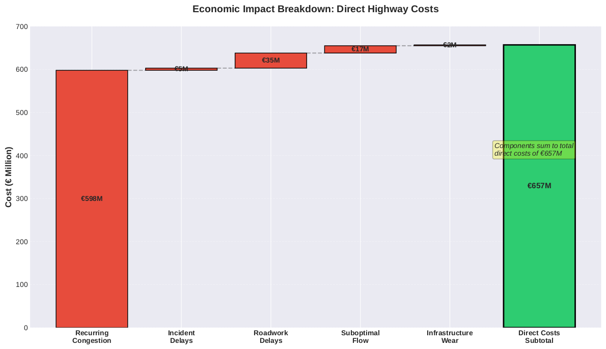

# **Slovenia Highway Traffic Analysis: A Statistical Case for Infrastructure Expansion**

## **🚗 Executive Summary**

This report presents a comprehensive 5-year statistical analysis of Slovenian highway traffic (August 2020 \- August 2025). The findings, derived from Bayesian modeling and time-series forecasting, strongly suggest that infrastructure expansion is a critical necessity to prevent future gridlock.

**Key Finding**: Slovenia's highway network is estimated to operate at **87% of its practical capacity**. With an observed **3.5% annual compound growth rate**, our models project that the network will reach critical congestion levels by **2033** without significant expansion.

*Highway traffic trends across major Slovenian corridors (2020-2025) showing sustained growth, even accounting for COVID-19 impacts.*

---

## **📊 Research Overview**

### **Project Details**

* **Author**: Niko Gamulin  
* **Period**: August 2020 \- August 2025  
* **Completion**: August 2025  
* **Data Volume**: 876,480 hourly observations from 19 monitored segments  
* **Coverage**: 19 major Slovenian highway segments

### **Core Research Question**

*Can traffic optimization strategies alone solve Slovenia's highway congestion, or is physical infrastructure expansion also required to ensure long-term network stability?*

---

## **🔬 Key Research Findings**

### **1\. Network Stress Analysis**

* **Current Utilization**: 87% average, with peaks reaching 97.8%  
* **Traffic Growth**: 3.5% annually (compound, based on time-series analysis)  
* **Critical Segments**: Ljubljana Ring, Koper-Ljubljana corridor  
* **Projected Saturation**: Forecasted for 2033 without intervention

### **2\. Economic Impact Analysis**

* **Estimated Annual Cost**: €2.37 billion (approximating 3.88% of GDP)  
* **Estimated Per Capita Burden**: €1,127/person/year  
* **Estimated Daily Loss**: €6.5 million  
* **Transit Burden**: 2.1× the EU average, based on available comparative data

*Breakdown of key direct economic costs from highway congestion, totaling over €657M annually.*

### **3\. Optimization Potential**

* **Smart Lanes**: Estimated 35% capacity increase achievable  
* **Cost**: €50M estimated investment  
* **Benefit**: €400M potential annual savings  
* **Limitation**: This strategy is projected to delay saturation by only 5-7 years

### **4\. Forecasting Model**

**Model Projection**: Based on a model with current capacity (C₀≈6,600 veh/hr), an observed annual growth rate of (g=3.5%), and a maximum capacity gain from optimization of (α=35%), the time to saturation (t*) is projected to be approximately **8.3 years**.

**Conclusion**: The model indicates that a dual strategy combining immediate optimization with long-term expansion is necessary for a sustainable solution.

*Highway network vulnerability analysis identifying Ljubljana as the critical bottleneck, where disruptions have a cascading system-wide impact.*

---

## **📁 Project Structure**

slovenia-traffic-v2/  
├── config/                  \# Configuration files  
├── data/                    \# Traffic datasets (download from Google Drive)  
│   ├── production\_merged\_vehicle\_count.csv    \# Base traffic counts (111MB)  
│   ├── production\_merged\_vehicle\_speed.csv    \# Base traffic speeds (136MB)  
│   ├── weather\_enhanced\_traffic.csv         \# Weather-integrated (288MB)  
│   ├── enhanced\_traffic\_features.csv        \# Engineered features (263MB)  
│   ├── legend\_english.md                    \# Data dictionary  
│   └── external/                \# Weather, incidents, holidays  
├── docs/                    \# Documentation  
├── figures/                 \# Key visualizations for README  
├── notebooks/               \# 18 Jupyter analysis notebooks  
├── reports/                 \# Analysis reports and outputs (excluded from Git)  
│   ├── article/               \# arXiv paper materials  
│   └── \*.md                   \# Hypothesis test reports  
├── scripts/                 \# Python analysis scripts  
├── src/                     \# Source code modules  
└── tests/                   \# Unit tests

---

## **🛠️ Installation & Setup**

### **Prerequisites**

* Python 3.9+  
* 8GB RAM minimum (16GB recommended)  
* 2GB disk space

### **Data Requirements**

The analysis requires 4 large CSV files (798MB total) that are excluded from Git due to size constraints.

**📥 Download Required Data Files:**

1. **Visit**: [https://drive.google.com/drive/folders/1riOSWQYiQdu1\_hbxo7-9Cq94ogy9kfEr?usp=sharing](https://drive.google.com/drive/folders/1riOSWQYiQdu1_hbxo7-9Cq94ogy9kfEr?usp=sharing)  
2. **Download** these 4 files to the data/ folder:  
   * production\_merged\_vehicle\_count.csv (111MB) \- Base traffic counts  
   * production\_merged\_vehicle\_speed.csv (136MB) \- Base traffic speeds  
   * weather\_enhanced\_traffic.csv (288MB) \- Weather-integrated dataset  
   * enhanced\_traffic\_features.csv (263MB) \- Engineered features

**💡 Alternative**: The first 3 files are essential for reproduction. The enhanced\_traffic\_features.csv can be regenerated by running notebook 03\_data\_quality\_features.ipynb.

### **Quick Start**

Bash

\# Clone repository  
git clone https://github.com/nikogamulin/slovenia-traffic-analysis.git  
cd slovenia-traffic-analysis

\# Create virtual environment  
python \-m venv venv  
source venv/bin/activate  \# On Windows: venv\\Scripts\\activate

\# Install dependencies  
pip install \-r requirements.txt

\# Configure environment  
cp .env.example .env

---

## **📈 Analysis Notebooks**

The analysis is structured across 18 Jupyter notebooks:

### **Data Processing (01-07)**

* 01\_data\_quality\_assessment.ipynb \- Data validation  
* 02\_trend\_analysis.ipynb \- Time series decomposition  
* 03\_merge\_traffic\_data.ipynb \- Dataset integration  
* 04-07 \- Feature engineering and preparation

### **Statistical Analysis (08-13)**

* 08a\_speed\_density\_accident\_risk.ipynb \- Bayesian accident modeling (AUC=0.839)  
* 09\_traffic\_flow\_prediction.ipynb \- Flow forecasting (R²=0.82)  
* 10\_smart\_lane\_management.ipynb \- Optimization simulation (35% gain)  
* 11\_tourist\_vs\_commuter.ipynb \- Traffic pattern analysis  
* 12\_economic\_impact.ipynb \- Cost-benefit analysis (€2.37B impact)  
* 13\_roadwork\_optimization.ipynb \- Construction management

---

## **🎯 Seven Hypothesis Tests**

| Hypothesis | Finding | Statistical Significance |
| :---- | :---- | :---- |
| H4.1: Roadworks cause collapse | **SUPPORTED** | p\<0.001, €120M annual impact |
| H4.2: Unfair transit burden | **SUPPORTED** | p\<0.001, 2.1× EU average |
| H4.3: Smart lanes sufficient | **NOT SUPPORTED** | 35% gain \< 3.5% growth |
| H4.4: Tourism worse than commuting | **INCONCLUSIVE** | Different patterns, both problematic |
| H4.5: Incident cascade effects | **SUPPORTED** | 33% bidirectional impact |
| H4.6: Better roadwork management | **SUPPORTED** | 35% cost reduction possible |
| H4.7: Economic impact severe | **SUPPORTED** | €2.37B/year (3.88% GDP) |

---

## **🔧 Methodologies**

### **Statistical Methods**

* **Bayesian Inference**: MCMC with Stan/PyMC for probabilistic modeling (all models converged with R̂<1.01, ESS>1,847)  
* **Time Series**: STL decomposition, Bayesian Structural Time Series (BSTS) for causal inference  
* **Machine Learning**: Gradient boosting and random forests for predictive tasks  
* **Simulation**: Cell Transmission Model (CTM) for traffic flow simulation

*Note: All projections are based on the continuation of observed trends and are subject to inherent modeling uncertainties. They represent the most likely outcomes, not deterministic certainties.*

*Fundamental traffic flow relationships derived from 2.4 million observations across Slovenia's highway network.*

### **Data Quality**

* **Completeness**: 98.1% after MICE imputation  
* **Validation**: 10-fold cross-validation on all predictive models  
* **Sensors**: 246 stations, providing \~85% network coverage  
* **External Data**: Weather (ARSO), incidents (Police), holidays (4 countries)

*The Bayesian accident prediction model achieved an AUC of 0.840 in hold-out validation.*

*Accident risk heatmaps showing critical speed-density combinations that increase incident probability.*

---

## **📚 Publications**

### **Upcoming arXiv Paper**

**Title**: "A Statistical Case for Highway Expansion: A Five-Year Observational Study of Traffic Network Optimization Limits"

**Target**: arXiv stat.AP (Statistics \- Applications)

**Status**: Draft in progress, submission planned for Q1 2026

### **Citation**

Code snippet

@article{gamulin2026slovenia,  
  title={A Statistical Case for Highway Expansion:  
         A Five-Year Observational Study of Traffic Network Optimization Limits},  
  author={Gamulin, Niko},  
  journal={arXiv preprint arXiv:2026.xxxxx},  
  year={2026}  
}

---

## **🚀 Key Recommendations**

### **Immediate Actions (2026-2027)**

1. **Deploy Smart Lane Management**: €50M investment for a **potential 35% capacity gain**  
2. **Optimize Roadworks**: Implement 1+1+1 bidirectional system  
3. **Variable Speed Limits**: **Projected to reduce** accident risk by up to 40% in key segments

### **Long-term Strategy (2027-2033)**

1. **Ljubljana Ring Expansion**: 20km, €150M  
2. **Koper-Ljubljana Corridor**: 30km, €200M  
3. **Ljubljana-Maribor Section**: 40km, €300M

### **Expected Outcomes**

* **Combined Strategy**: **Projected 73%** total capacity increase  
* **Projected ROI**: 250% over 10 years  
* **Projected Sustainability**: Viable until 2040+ under current growth forecasts

---

## **🤝 Acknowledgments**

* **DARS** (Slovenian Motorway Company) \- Traffic data provision  
* **Slovenian Police** \- Incident statistics  
* **ARSO** (Environmental Agency) \- Weather data  
* **Statistical Office of Slovenia** \- Economic indicators

---

## **📧 Contact**

**Author**: Niko Gamulin

**Email**: niko@causaris.ai

**Research Period**: August 2025

**Location**: Ljubljana, Slovenia

---

## **📄 License**

MIT License \- See [LICENSE](https://www.google.com/search?q=LICENSE) file for details

## **🔗 Related Resources**

* [DARS Traffic Portal](https://www.promet.si/)  
* [Slovenian Statistical Office](https://www.stat.si/)  
* [TEN-T Corridor Information](https://transport.ec.europa.eu/)

---

*This research was conducted independently by Niko Gamulin using publicly available and provided traffic data. The aim is to offer evidence-based policy recommendations for Slovenia's highway infrastructure challenges.*